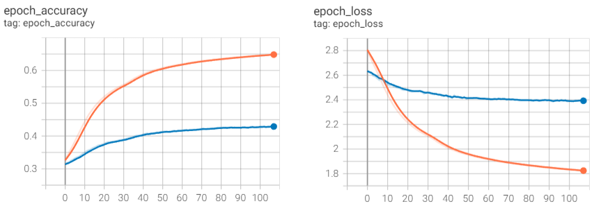

# Native language identification

This is a toy project experimenting with ML. The goal is to be  able to identify a native language of a non-native English speaker from their Reddit comments.

The model achieves about 43% accuracy on the provided validation dataset across 47 countries.


> :warning:
> In my observation, rather than learning peculiarities of English language usage by a non-native speaker, the model tends to perform classification based on the content of the comments. Training on a larger dataset may improve this.

## Training
### Training dataset
The included training dataset is taken from [this project](https://github.com/masalha-alaa/native-language-recognition), which is a scpated Reddit comments from year 2021. This is a rather small dataset of only about a million sentences downloaded from Reddit comments.

A bigger dataset can be found [here](http://cl.haifa.ac.il/projects/L2/).

### Model
The model is a simple bidirectional LSTM using Bert tokenizer. Input text classification is performed across 47 classes (countries), which are available in the daset.

### Running training
Starting training from scratch:
```shell
python ./run_training.py
```

Continue from a checkpoint:
```shell
python ./run_training.py <checkpoint file>
```

### Running inference

First you have to prepare `inference.yaml` configuration file that contains the [Reddit API credentials](https://www.reddit.com/wiki/api) and a reference to the model checkpoint:

```yaml
user: <Your Reddit user name>
password: <Reddit password>
client_id: <Reddit API client ID>
client_secret: <Reddit API client secret>

checkpoint: <checkpoint name>
```

Then to run a language identification on a user:

```shell
python ./id_reddit_user.py <Reddit user name>
```

This will download all available comments of the specified Reddit user and run the classification of each comment. The resulting identification is obtained by summing up all the distribution from all the comments, and normalizing the result.
